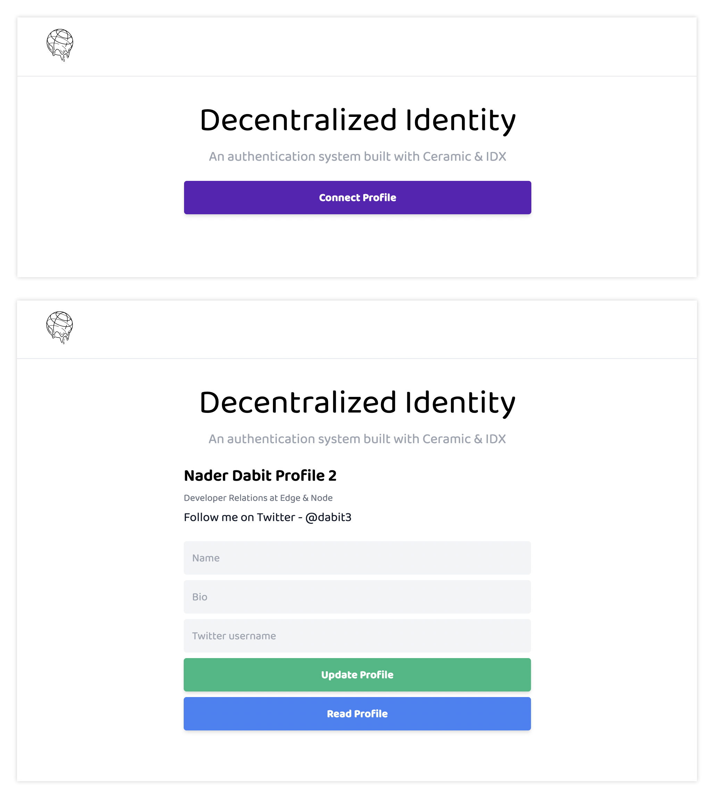

## Decentralized identity

This project implements a user authentication flow leveraging an Ethereum wallet for single sign on capabilities across all of Web3.

The technologies used are [DID (decentralized identifiers)](https://www.w3.org/TR/did-core/), [Ceramic](https://ceramic.network/), [3id-connect](https://github.com/ceramicstudio/3id-connect), and [IDX](https://developers.idx.xyz/learn/welcome/).



### Running this project

#### Gitpod

To deploy this project to Gitpod, follow these steps:

1. Click this link to deploy

[](https://gitpod.io/#github.com/dabit3/decentralized-identity-example)

#### Local development

To get up and running with this project:

1. Install an Ethereum wallet like [MetaMask](https://metamask.io/)

2. Clone the project

```sh
git clone https://github.com/dabit3/decentralized-identity-example.git
```

3. Change into the directory, install dependencies, then start the server:

```sh
cd decentralized-identity
npm install
npm run dev
```
